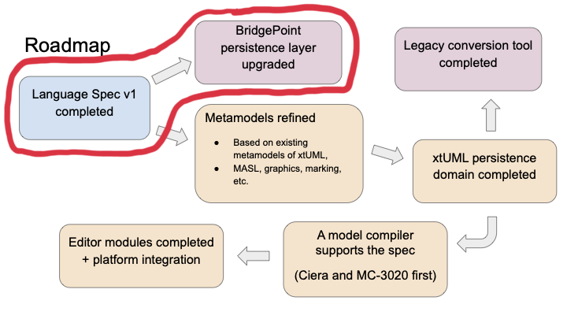

= Textual xtUML Specification and BridgePoint Support

xtUML Project Analysis Note

== 1 Abstract

The xtUML community has identified a need for a text-based language
specification for representing xtUML models. Among other reasons, this would
decouple the language from the tooling (BridgePoint), lower barrier to
involvement by users and developers alike, ensure long term viability of xtUML
models, and improve the quality of documentation concerning the language and its
tools.

In December of 2021, a draft specification of a text-based xtUML based on MASL
was written and distributed. TODO ref.

In the Spring of 2022, the BridgePoint team introduced a feature to persist
xtUML graphical layout in a textual format. TODO ref.

In October of 2022, a presentation was shared at the annual Shlaer-Mellor Days
conference outlining a proposal for such a language and a roadmap to achieve the
goal. TODO refs. This note is written to analyze a subset of the roadmap to
identify requirements and challenges related to the project.

== 2 Introduction and Background

Before going on, the reader should read the original specification (TODO ref),
and watch the presentation video (TODO ref).

Below is shown a slide from the Shaler-Mellor days presentation laying out a
roadmap for this work. This note will address the roadmap items circled in red.

== 3 Requirements

=== 3.1 Language Specification

Six related specifications shall be written:

- Core language
- Action language requirements
- Graphical layout
- Marking
- MASL
- BridgePoint xtUML

Each specification shall consist of written descriptions of the parts of the
language and lexical and parser grammars where appropriate. Each distinct rule
of the language shall be given an identifier to enable cross referencing with
test suites.

The so-called "informal diagrams" (Activity, Use Case, Sequence, etc.) shall not
be supported by this set of specifications.

==== 3.1.1 Core Language

The core language specification will capture the semantic parts of the language
except for activity bodies. This includes data models, behavior models,
interfaces, etc. as well as the built in constructs such as the type system and
execution rules.

==== 3.1.2 Action Language Requirements

The action language specification shall define the minimum requirements for a
compatible action language though no specific action language shall be
prescribed at the start.

==== 3.1.3 Graphical Layout

The graphical layout specification shall define the format for capturing
graphical layout data for the semantic models.

==== 3.1.4 Marking

The marking specification shall define the format for capturing additional
annotations on model elements. This data is used by specific tools to attach
configuration data independent of the models themselves.

==== 3.1.5 MASL

The MASL specification shall be an extension of the core language specification
to provide backward compatibility to existing MASL models.

==== 3.1.6 BridgePoint xtUML

The BridgePoint xtUML specification shall be an extension of the core language
specification to provide backward compatibility to the current version of xtUML
implemented by BridgePoint. It is expected that some fringe features of the
language will be deprecated during the process of writing the core
specification. Therefore, this additional specification will be required to
capture the differences without carrying unnecessary complexity forward.

==== 3.1.7 Versioning

Each specification shall be strongly versioned. A survey of other
languages/standards/specifications shall be conducted to determine an
appropriate versioning strategy. The versioning strategy shall be conducive to
incremental improvement.

==== 3.1.8 Distribution Media

The specifications shall be written in AsciiDoc. They shall be viewable on GitHub
directly in the repository. Generation of HTML and PDF versions of the
specification shall be supported.

==== 3.1.9 Community Review and Incremental Improvement

This specification shall be written and maintained in public view of the xtUML
and Shlaer-Mellor communities. The writers shall seek feedback through
appropriate channels at each stage of creation and future maintenance. Existing
BridgePoint users shall be consulted on the details of their usage of the
language and its more fringe features.

Future versions of this specification shall be maintained collaboratively by
users of the specification. Other community members are encouraged to
participate, but active users of the spec (tool developers and tool users) shall
be prioritized.

A process shall be outlined to make changes to the specification and publish new
versions. The writers shall look to the example of other successful
languages/standards/specifications for guidance.

=== 3.2 BridgePoint Support

The BridgePoint persistence mechanism shall be updated to support the core
language, graphical layout, and marking specifications.

==== 3.2.1 BridgePoint Core Language Persistence

BridgePoint shall support loading and persisting full xtUML meta-models as text
files compliant with the core language specification.

The "informal diagrams" shall continue to be persisted as SQL insert statements
and shall be linked at load time to the semantic instances.

==== 3.2.2 BridgePoint Graphical Layout Persistence

BridgePoint already supports graphical persistence as text. The implementation
shall be updated to be compliant with the specification defined here.

==== 3.2.3 BridgePoint Marking Persistence

The BridgePoint marking editor shall be updated to be compliant with the
specification of marking data defined here.

== 4 Analysis

=== 4.1 Survey of other languages and standards

As mentioned in the requirements section, it was deemed prudent to do some
research as part of this analysis to find good examples of languages/standards
with excellent documentation and community coordination. The goal is to find a
format which strikes a good balance between RFC-style technical specification
and more reader-friendly reference manual. An excellent solution should have the
following qualities:

. Approachable for technical and non-technical readers
. Complete enough that no other resource is necessary
. Well indexed such that answers to specific questions can be found quickly
. Versioned such that logical chunks of the specification can be referenced
  specifically
. Set up with a clear process for making changes and improvements

Below is the results of the survey:

TODO

=== 4.2 BridgePoint Support

==== 4.2.1 High level strategy

The existing graphical persistence as text can function as the proof of concept
for this work. Xtext was chosen as the tool to generate load/persist structures
from the grammar for the language. A Java class is provided to handle population
of the OOA of graphics from the generated EMF model. Another Java class is
provided to do the opposite function of populating the EMF model from the OOA of
graphics. This strategy has proven to be effective, however it couples the
application tightly to Java, Eclipse, and Xtext.

Another strategy that could be used for this work is to extend the existing MASL
to xtUML and xtUML to MASL converters (`masl2xtuml` and `xtuml2masl`). These are
implemented as independent models and generated with MC-3020 to compiled
executables. The benefit of this approach is looser coupling of the load/persist
process. The downside is that it makes the integration with Eclipse more brittle
and would run into problems with loading/persisting individual files and
watching for file changes.

==== 4.2.2 Other challenges

There are a few other notable challenges that have already been identified.

===== 4.2.2.1 Interfacing with informal diagrams

As noted in the requirements, the specification will not cover the informal
diagrams. This means that in order to maintain support in BridgePoint for these
model types, the old SQL insert statement based persistence must be used for
these diagrams. A solution must be found to handle the case where relationships
bridge from these classes to classes in the executable part of the model.

===== 4.2.2.2 Creating instances from scratch

One major difference between the work that has been done with graphics and this
work is the existence of the graphics reconciliation system. The graphics
reconciler knows how to create and relate an instance population of graphical
elements using only the exiting instance population of semantic instances (e.g.
a new shape is created for every class; a new connector is created for every
relationship). The textual load works by first letting the graphics reconciler
run. After it completes, the instance population is queried and the attributes
are updated according to the data parsed from text (position, size, color, etc.)

By contrast, there is no such reconciler for semantic instances. All of the work
of creating and relating the instance population based on the parsed text must
be done from scratch.

===== 4.2.2.3 Updating the current graphics format

At the moment, the textual graphics is implemented as a custom language. It is
likely that the final specification for graphical layout data will be a schema
overlaid on an existing human-readable configuration format like YAML. The
implementation will need to be updated to support this format.

===== 4.2.2.4 Persistence order

As one of the major goals of this work is to make the underlying model data more
human-readable, diffable, and even editable, it is more important than ever to
pay attention to order in which elements appear in a file. If a small change
results in a non-functional change in the order of elements, diffs between
versions of a file can get cluttered with non-functional changes. The order must
be stable.

Sorting is one way to provide consistent ordering. This is an acceptable
solution, but does not allow the user to change the order in the file.

Adding ordering relationships in the model would allow the exact file order to
remain consistent, however it is more difficult and requires changes to the
meta-models.

MC-Java uses Java `ArrayList`s under the hood to maintain instance lists.
Because of this architectural reality, instances are maintained in creation
order. Relying on this property of the architecture to maintain file order may
be "good enough" for now.

== 5 Work Required

TODO

== 6 Document References

. initial specification
. presentation video
. presentation PDF
. MASL links

. [[dr-1]] https://support.onefact.net/issues/NNNNN[NNNNN - headline]
. [[dr-2]] ...
. [[dr-3]] link:../8073_masl_parser/8277_serial_masl_spec.md[Serial MASL (SMASL) Specification]

---

This work is licensed under the Creative Commons CC0 License

---
